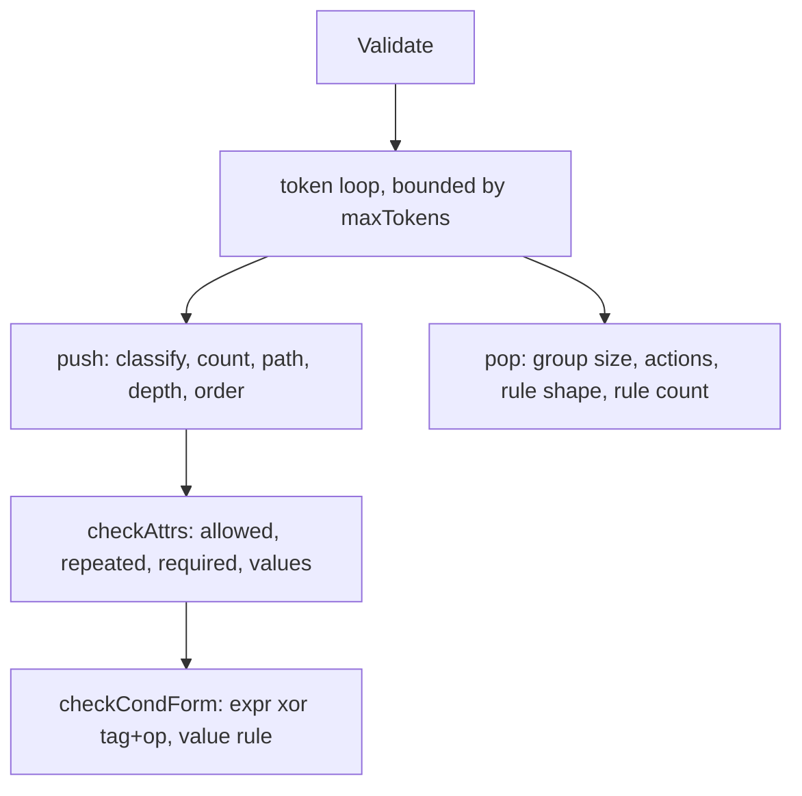

# Software Implementation: rulesxml vocabulary tables and walk

## Overview

The modbus2mqtt package moves as it is. The tables in `schema.go` gain two
element kinds and six attributes. `attrs.go` gains the either-or check on
`cond`, the identifier pattern, and the text lengths.

## Static View (Structure)

Tables that change:

- `elementNames`: add `variables`, `var`. `kindCount` becomes 10.
- `allowedChildren`: `rule` gains `variables`. `variables` allows `var`.
- `allowedAttrs`: `cond` gains `expr`, `description`. `and` and `or` gain `description`. `var` has `name`, `formula`, `description`. `incident` gains `first_step`, `cause`.
- `requiredAttrs`: `var` has `name`, `formula`. `cond` loses `tag`, `op` (the form check replaces them). `incident` has `source`, `severity`, `summary`.
- `indexedIn`: `var` under `variables`.
- `childPhase`: `variables` is phase 0, before the condition.
- Limits: `MaxVariables = 64`, `MaxActions = 64`, `MaxText = 240`. `maxStackDepth` becomes 9.

## Dynamic View (Logic)

The walk is unchanged. On `pop` of `variables`, the count of `var` must be at
most 64. On `pop` of `actions`, the count of `publish` must be 1 to 64. On
`push` of a level-1 `and` or `or`, a `description` is a problem.

The `cond` form check reads the attribute list once. `expr` together with
`tag` or `op` is a problem. Neither form present is a problem. An `op` other
than `changed` without a `value` is a problem.

## Interface & API Definitions

`Validate(r io.Reader) []Problem` and `Problem{Path, Message}` are unchanged.
The `rules` package wraps `Problem` into its own type with a `Rule` field.

## Error Handling & Edge Cases

- Malformed XML stops the walk with one problem at the current path.
- The 200-problem cap and the 1 MiB input limit stay.
- `cooldown="0"` is accepted. The `knownDivergence` entry for it is deleted.

## Notes

The parity test reads `../../schema/rules.xsd` and `../../schema/fixtures/`.
