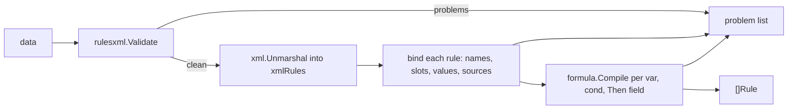

# Software Implementation: Catalog, Load pipeline and Problem list

## Overview

`Load` is a four-stage pipeline. Every stage appends to one problem list.
A stage that finds a problem does not stop the others, except that binding
does not start on a document with structural problems.

## Static View (Structure)



`Catalog` gets an index at `Load`: `map[fieldKey]int` where `fieldKey` is
`{Device, Tag}`. `Sources` becomes a `map[string]bool`. Both live only during
`Load`.

## Dynamic View (Logic)

Per rule, in this order: name, `cooldown`, `edge`, variables (parse each
formula, detect cycles), the condition (a 0.2 `cond` is rewritten to its
formula text with the inverse of `legacyCondToFormula` and then compiled like
an `expr`), actions (topic and payload, literal or formula), incident (source
in `Sources`, severity, summary length, Then formulas). Each problem gets the
path of the element and the rule name.

## Interface & API Definitions

```go
func Load(data []byte, cat Catalog) ([]Rule, []Problem)
func Parse(r io.Reader, cat Catalog) ([]Rule, error) // joins problems with "\n"
```

`Rule` keeps `Name`, `Cond *formula.Program`, `Actions []action`,
`Incident *incidentConfig`, `Edge`, `Cooldown`, `FieldRefs []int`,
`HasChanged`, `HasTime`, and the private state.

## Error Handling & Edge Cases

- A `Catalog` with two equal `{Device, Tag}` entries returns one problem and no rule.
- A `Catalog` with no field is accepted. Every `TAG` is then a problem.
- The rewrite of a 0.2 `cond` quotes the value as the field type demands. `value="true"` on a `Bool` becomes `true`. On a `String` it becomes `"true"`.

## Notes

The 0.2 rewrite is the inverse of `legacyCondToFormula` in `src/formula.ts` and has the same test cases (ADR-013).
