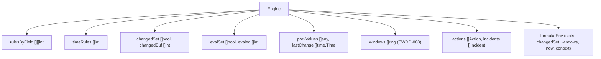
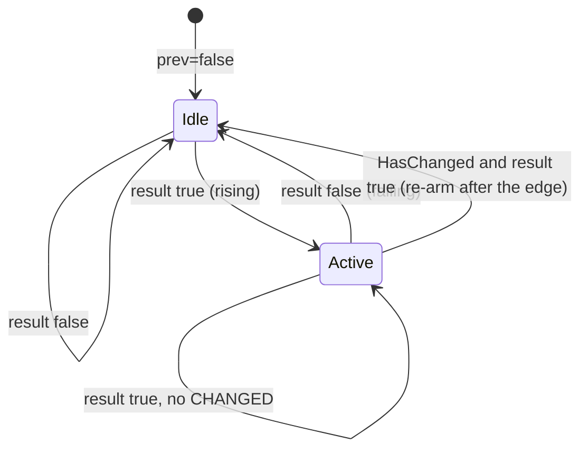

# Software Implementation: Engine core: scheduling, edge and cooldown state

## Overview

The structure is the current `engine.go` of the polling services:
`rulesByField`, `changedSet`, `changedBuf`, `evalSet`, `evaled`,
`prevValues`, and preallocated result slices. Three additions: a
`timeRules []int` list, the `HasChanged` re-arm, and `equalValue`.

## Static View (Structure)

## Dynamic View (Logic)

Per `Eval`: phase 1 detects changes with `equalValue` and records
`lastChange[i] = now`. Phase 2 evaluates the rules of changed slots, then the
time rules, each at most once (`evalSet`). Phase 3 copies the values and
clears the touched flags. The rule evaluation is the logic of SWREQ-003 with
`fireActions` and the incident machine of SWDD-004.

## Interface & API Definitions

`NewEngine(rules []Rule, cat Catalog) *Engine`, `Eval`, `Reset`, `RuleCount`.
`NewEngine` panics on a nil rules slice, on `len(cat.Fields) < 0`, and on a
rule whose `FieldRefs` exceed the field count. Every other fault is a `Load`
problem.

## Error Handling & Edge Cases

- `values` shorter than the catalog: the missing slots count as `nil`.
- `values` longer than the catalog: the extra slots are ignored.
- A `NaN` float compares as changed on every call. This is documented.
- The action loop per rule is bounded by `MaxActions = 64`.

## Notes

The shared `lastFired` between actions and trigger stays (ADR-004). The slot
model is ADR-003. The action cap is ADR-009.
