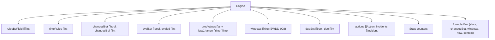
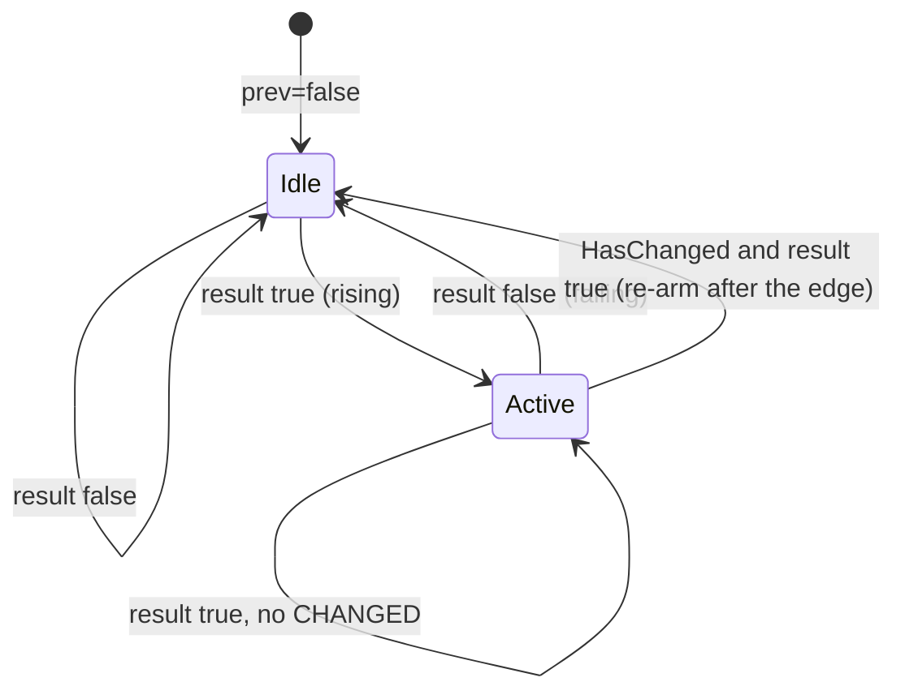

# Software Implementation: Engine core: scheduling, edge and cooldown state

## Overview

The structure is the current `engine.go` of the polling services:
`rulesByField`, `changedSet`, `changedBuf`, `evalSet`, `evaled`,
`prevValues`, and preallocated result slices. Three additions: a
`timeRules []int` list, the `HasChanged` re-arm, and `equalValue`.

## Static View (Structure)

## Dynamic View (Logic)

Per `Eval`: phase 1 detects changes with `equalValue` and records
`lastChange[i] = now`. Phase 2 marks the rules of changed slots and the time
rules as due (`dueSet []bool`, `due []int`). It then evaluates the due rules
in rule index order, which is the document order (ADR-016). Phase 3 copies
the values and clears the touched flags. The rule evaluation is the logic of SWREQ-003 with
`fireActions` and the incident machine of SWDD-004.

## Interface & API Definitions

`NewEngine(rules []Rule, cat Catalog) *Engine`, `Eval`, `Reset`, `RuleCount`.
`NewEngine` panics on a nil rules slice, on `len(cat.Fields) < 0`, and on a
rule whose `FieldRefs` exceed the field count. Every other fault is a `Load`
problem.

## Error Handling & Edge Cases

- `values` shorter than the catalog: the missing slots count as `nil`.
- `values` longer than the catalog: the extra slots are ignored.
- A `NaN` float compares as changed on every call. This is documented.
- A slot with a dynamic type outside the list increments `Stats.UnknownSlotTypes` and reads as `nil`.
- The action loop per rule is bounded by `MaxActions = 64`.

## Which rules evaluate, and when a pulse re-arms

A rule joins the change-driven index by the slots it reads. It joins the
time-driven set when it reads a clock **or** when its edge is `EdgeNone`
(ADR-025): `EdgeNone` fires on every evaluation where the condition is true, so
a steady value must not silence it. A rule with a rising edge keeps the index
alone, because it can only fire when something moves.

A pulse row is true only in the evaluation where its input moved, and is never
seen as false, so a rule that fires on one re-arms its edge. The row model
carries whether a row reads `CHANGED`, and only the row that made the rule true
decides the re-arm: the first true row of an "any" rule, or any row of an "all"
rule, since those are all true together. Re-arming because some other row reads
`CHANGED` turned a level into a pulse, and the rule fired once per cooldown for
as long as the level stood.

## Notes

The shared `lastFired` between actions and trigger stays (ADR-004). The slot
model is ADR-003. The action cap is ADR-009.
