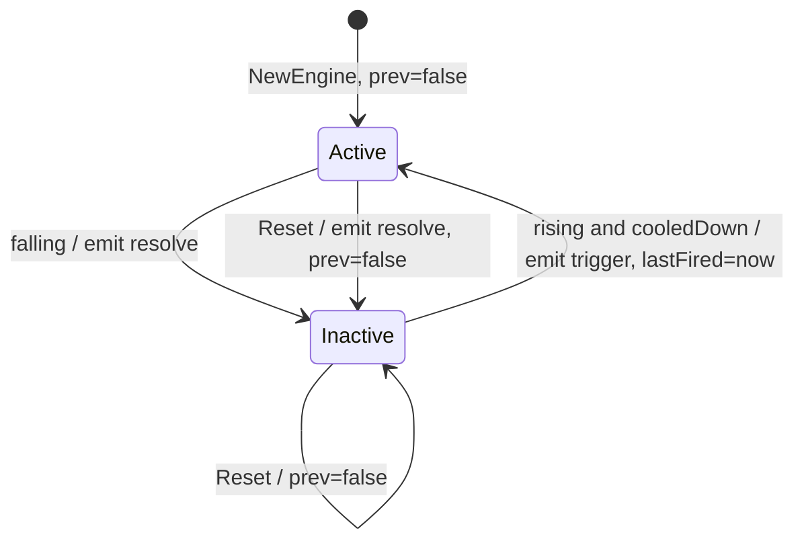

# Software Implementation: Incident state machine, Reset and Message

## Overview

The incident logic of the polling services (`incidentActive`) with the
`Reset` of tsend2mqtt and a value type `Incident` instead of the JSON struct.

## Static View (Structure)

Rule state: `prev bool`, `lastFired time.Time`, `active bool`,
`dedupKey []byte` (a slice of the rule buffer when `source` is a formula, a
`Load`-time string otherwise).

## Dynamic View (Logic)

`NewEngine` sets `active = true` and `prev = false` for every incident rule
(SYSREQ-015, ADR-014). The first evaluation then emits a trigger on a true
result, or a resolve on a false result, through the normal transitions.



`Reset(now)` iterates every rule once, appends a resolve for each active
incident, sets `active = false` and `prev = false`, and leaves `lastFired`.
It also clears the `CHANGED` node states and the window rings, so the first
`Eval` after a reconnect starts from unknown history. It keeps `lastChange`
of every slot, so `STALE` holds across a reconnect.

## Interface & API Definitions

```go
type Incident struct { Rule string; Trigger bool; Source, DedupKey, Severity, Summary, FirstStep, Cause string }
func (i Incident) Message(now time.Time) IncidentMsg
```

`Message` is the only function in the package that allocates after
`NewEngine`. The `Data` map holds `{"rule": i.Rule}`.

## Error Handling & Edge Cases

- A second trigger during an active incident needs a rising edge. A rising edge needs `prev == false`, and `prev` is true during an active incident. The exception is a `CHANGED` re-arm. After a re-arm, a second trigger with the same key is possible. The forwarder treats it as a duplicate (events protocol).
- A resolve never carries `Severity`, `Summary`, `FirstStep`, `Cause`.

## Notes

`first_step` and `cause` on the wire are ADR-007.
