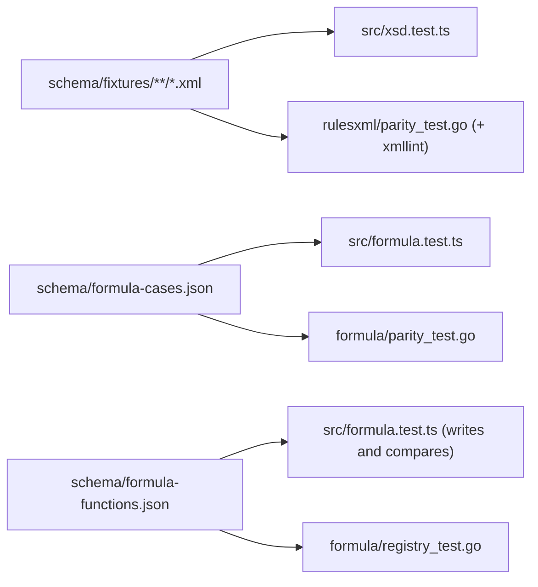

# Software Implementation: Shared fixtures and parity tests

## Overview

Three files under `schema/` and four tests: two in TypeScript, two in Go.

## Static View (Structure)

## Dynamic View (Logic)

- Export: a one-time script `scripts/export-fixtures.ts` writes each entry of `VALID`, `INVALID`, `APP_LEVEL`, `XSD_STRICTER` to a file named by its description, as modbus2mqtt did by hand. After the export, `xsd.test.ts` reads the directories.
- Formula cases: a one-time export of the `parseFormula` and `printFormula` expectations of `formula.test.ts` to JSON. The TypeScript test keeps its AST assertions and adds the file loop.
- Registry: `formula.test.ts` serializes `FUNCTIONS` and compares with the file. On a mismatch, the test fails with the diff and the developer commits the new file.
- Go: `parity_test.go` in `rulesxml` gives each fixture to `Validate` and to `xmllint`, with the `knownDivergence` map for the two app-level fixtures. `formula/parity_test.go` parses and prints each case. `formula/registry_test.go` makes sure that each function has an evaluator case and the same arity.

## Interface & API Definitions

File formats as in SWREQ-012.

## Error Handling & Edge Cases

- `xmllint` missing: the Go test skips locally and fails when `CI=true`.
- A fixture with a description that is not a valid file name: the export replaces every character outside `[a-z0-9-]` with `-`.

## Notes

ADR-012.
