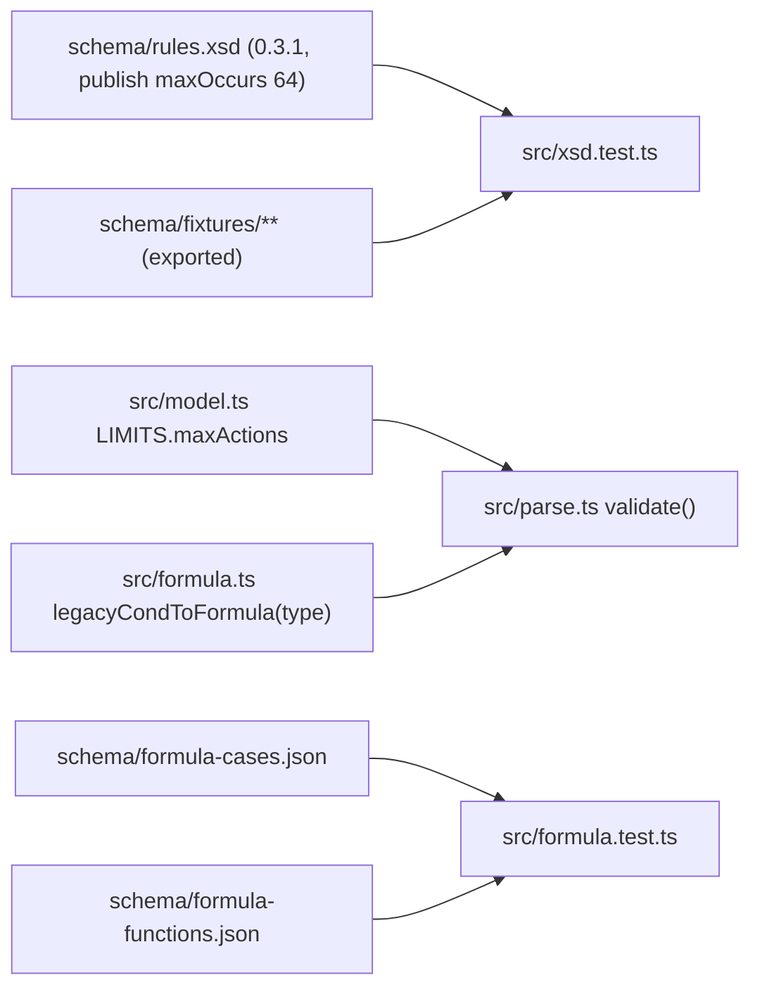

# Software Implementation: Editor package changes

## Overview

Eight small edits in the TypeScript package, one pull request.

## Static View (Structure)

## Dynamic View (Logic)

1. A one-time vitest file exports each fixture of the four tables to `schema/fixtures/<class>/<slug>.xml`, where `slug` is the description with every character outside `[a-z0-9-]` replaced by `-`. It writes the reason of each divergence to `schema/fixtures/reasons.json` and is then deleted: the files are the source from that point on.
2. `src/xsd.test.ts` reads the four directories, and reads the reasons from `reasons.json`.
3. `src/formula.test.ts` keeps its AST assertions and adds a loop over `formula-cases.json`. A second test serializes `FUNCTIONS` and compares with `formula-functions.json`.
4. `legacyCondToFormula(leaf, type?)`: with `type === 'boolean'`, `1` and `0` become `true` and `false`. With `type === 'string'`, every value becomes a quoted string. `TagEntry` gains an optional `type`, `parse(xml, catalog?)` takes the catalog, and `condRow` reads the type of the field from it.
5. `validate()` reports `Rule "r": has 65 actions (max 64).`

## Interface & API Definitions

No public API change. `legacyCondToFormula` gains an optional parameter.

## Error Handling & Edge Cases

- A fixture description that collides with another after the slug replacement gets a numeric suffix.
- The registry file is committed. A drift fails the test with a diff.

## Notes

SWREQ-018, ADR-009, ADR-012, ADR-015.
