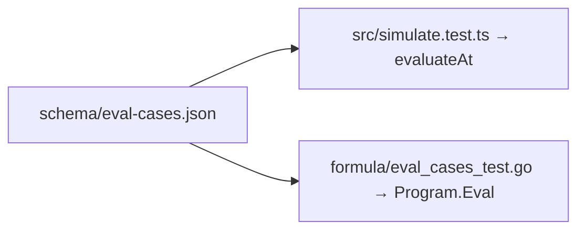

# Software Implementation: The shared evaluation cases

## Overview

One file and two readers, the same shape as the parser cases of SWDD-010.

## Static View (Structure)

```json
{ "name": "a different value after an outage is a change",
  "formula": "CHANGED(TAG(\"n\"))",
  "types": { "n": "number" },
  "step_seconds": 60,
  "steps": [ { "values": { "n": 1 },    "want": false },
             { "values": { "n": null }, "want": false },
             { "values": { "n": 2 },    "want": true } ] }
```



## Dynamic View (Logic)

- The TypeScript reader builds the value of every tag at every step, so a time function can look back, and calls `evaluateAt(ast, i, env)` once per step.
- The Go reader compiles the formula against a resolver built from the `types` map, in name order, so a slot means the same thing on every step. Before each step it advances the windows, writes the values, records what changed, and feeds the numeric changes to the rings, which is what the engine does before it evaluates.
- A missing key in `values` keeps the value of the step before.

## Interface & API Definitions

Test only, in both languages.

## Error Handling & Edge Cases

- A case with a device in its `TAG` call is not supported: the readers bind one implicit source.
- An expected number matches an integer of the same value on the Go side.

## Notes

ADR-020. The parser cases are SWDD-010; this is the same mechanism one level
up, from text to answers.
