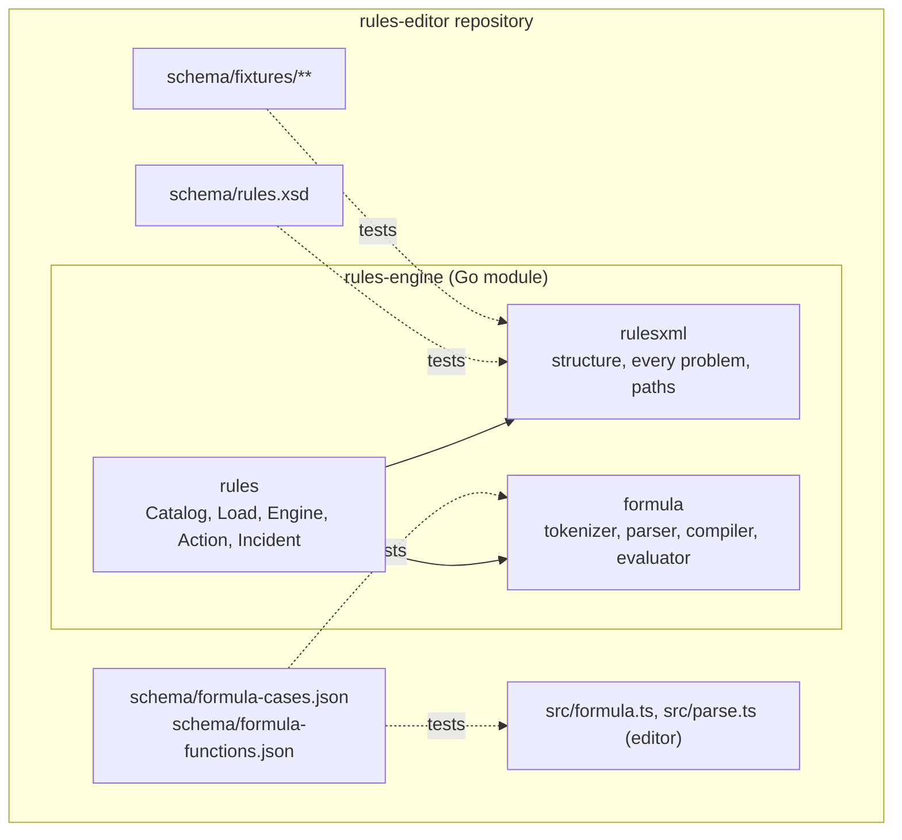
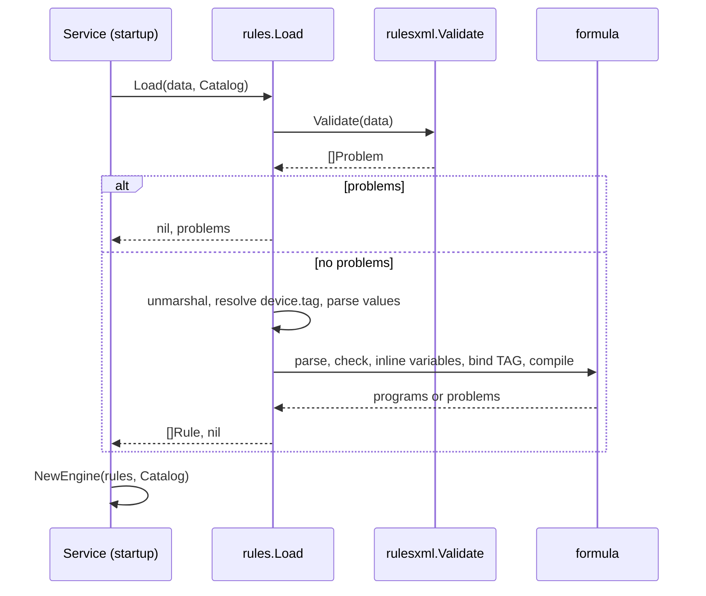

# Architecture: The rules-engine module

## Technical Strategy

The module lives next to the XSD, the fixtures and the formula language that
define the format. One commit changes the format and the engine together. The
three packages separate the structure of the file, the binding to a service,
and the formula language.

## Static View (Structure)

- `rulesxml` walks the XML tokens with fixed tables of elements and attributes. It knows the 0.3 vocabulary.
- `rules` binds a document to a `Catalog`, builds the `Engine`, and returns `Action` and `Incident` values.
- `formula` parses a formula to an AST, does the static checks, compiles the AST to a program, and evaluates the program.
- The test files read `../../schema/...` with `os.ReadFile`.

## Dynamic View (Behavior)

## Versions and tags

- Module path `github.com/o16s/rules-editor/rules-engine`. Tags `rules-engine/vX.Y.Z`.
- `X.Y` follows the schema version. `rules-engine/v0.3.x` implements schema 0.3.
- `go 1.24`, no dependencies.
