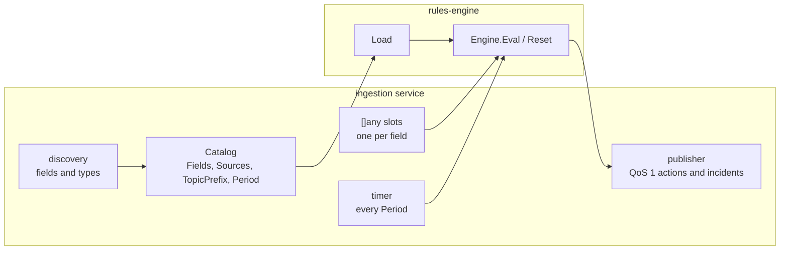
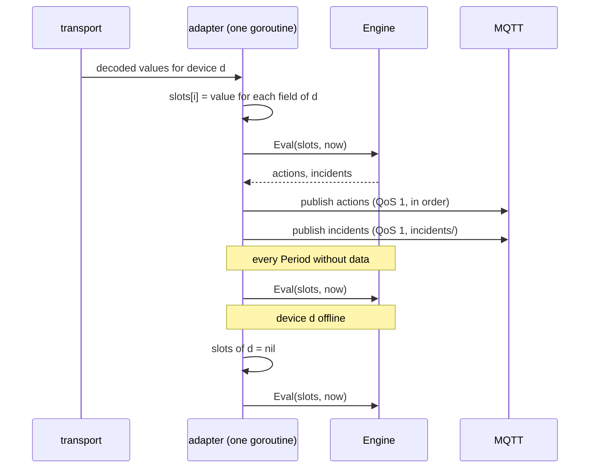

# Architecture: Service adapter and data flow

## Technical Strategy

The engine does not know PLC frames, IO-Link ports or Modbus registers. Each
service maps its decoded data to a flat slot array and hands the array to the
engine. The service keeps its transport, its discovery, its publisher and its
logging.

## Terms

- **Device report**: the decoded fields that one successful poll of one device returns. In modbus2mqtt this is a `bus.Report` with values. In iolinkmaster2mqtt it is the decoded process data of one port in one poll cycle. In tsend2mqtt it is one frame, which always carries every field.
- **Slot**: one entry of the value array. Slot `i` holds the value of `Catalog.Fields[i]`.
- **Firing**: one evaluation in which a rule emits its actions, its incident trigger, or both.
- **Pulse**: a condition that is true only in the evaluation where a value changed.

## Static View (Structure)

| Responsibility | Service | Engine |
|---|---|---|
| Know the devices, tags and types | yes | no |
| Read and validate the rules file | calls `Load` | yes |
| Own the slot array, write values and `nil` | yes | reads |
| Write `nil` for a catalog field that a device report lacks | yes | no |
| Detect changes between calls | no | yes |
| Edge, cooldown, incident state, time windows | no | yes |
| Render the incident JSON | calls `Message` | provides |
| Publish to MQTT | yes | no |
| Timer for time functions | yes | evaluates |
| `Reset` on reconnect | calls | provides |

## Dynamic View (Behavior)

## Per service

| Service | Catalog source | Device in `<cond>` | Timer | Reset |
|---|---|---|---|---|
| tsend2mqtt | `.udt` layout fields, S7 types | absent, `Device == ""` | 1 s, under the frame mutex | on TCP reconnect |
| iolinkmaster2mqtt | `driver.DiscoverFieldTypes` | required | the poll cycle | no |
| modbus2mqtt | driver field types | required | the aggregator loop | no |
